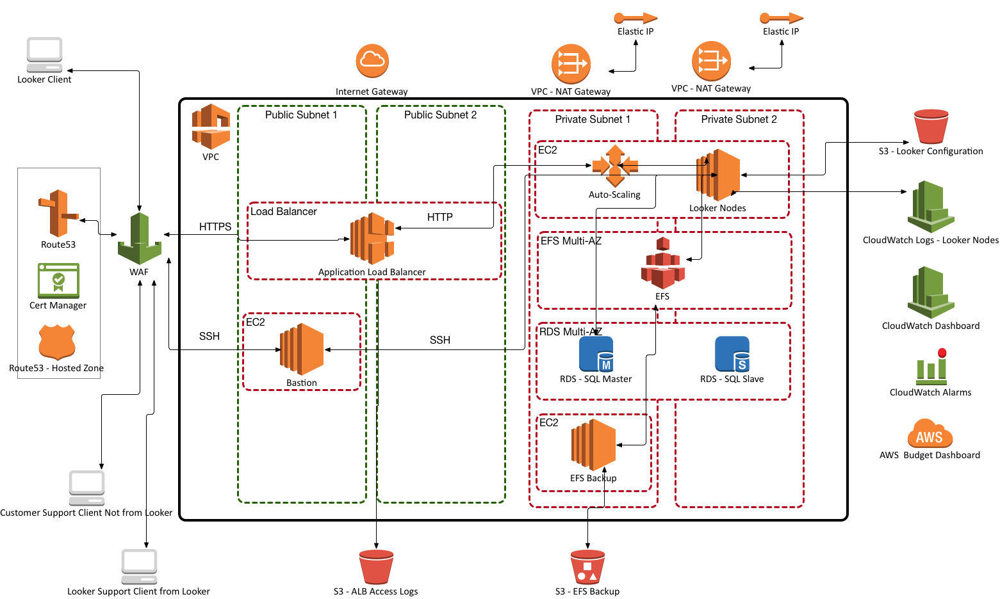

# What is this?

This is the [terraform](https://www.terraform.io/) code to create the following Looker architecture(assuming all the VPC's / Subnets are already in place).

The [tf_s3_state](https://github.com/turnerlabs/looker_stack_aws_ec2_tf/tree/master/tf_s3_state) path contains the terraform code to create an s3 bucket to store the terraform state for the terraform code in the other directory.

The [tf_existing_network](https://github.com/turnerlabs/looker_stack_aws_ec2_tf/tree/master/tf_existing_network) path contains the terraform code to create the complete AWS Looker stack using existing VPC's and Subnets.

**Please refer to https://github.com/turnerlabs/looker_stack_aws_ec2_ami for creating the AMI's that run in this stack.**
